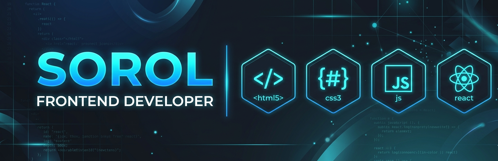

<!-- HERO BANNER -->

  

  

  <b>Frontend Developer • UI/UX Designer • Creative Builder</b>

<!-- TYPING ANIMATION -->

  

<!-- BADGES -->

  
  
  

<!-- VISITOR COUNT -->

  

---

## 🎨 About Me

I’m a **Frontend Developer & UI/UX Enthusiast** passionate about building modern, scalable, and visually engaging web experiences.

- 🎯 Specialized in **UI/UX & interaction design**
- ⚡ Focused on **performance & responsiveness**
- 🎬 Skilled in **animations & micro-interactions**
- 🤖 Exploring **AI-powered frontend applications**
- 🤝 Open to **freelance, internships & collaborations**

---

## 🧰 Tech Stack

  

---

## 🚀 Featured Projects

### 🍔 Khadok 2.0 — Restaurant Management System

  

- Built a **modern food discovery platform**
- Designed **clean and responsive UI**
- Implemented **real-time interaction features**

---

### 🎯 Portfolio Website

  

- Developed **interactive portfolio with animations**
- Focused on **visual storytelling & UX flow**
- Smooth transitions and modern layout

---

### 🤖 AI Integrated Interface

  

- Designed **frontend for AI-powered system**
- Integrated APIs for dynamic interaction
- Focus on **usability & accessibility**

---

## 📊 GitHub Stats

  
  

  

---

## 📈 Contribution Activity

  

---

<!-- VALUE PROPOSITION -->

<h2 align="center">🚀 What I Bring to the Table</h2>

  
  
  

  
  
  

  <i>I don’t just build interfaces — I craft experiences that users remember.</i>

---

## ⚡ Advanced Metrics

  

---

## 💬 Philosophy

<!-- PHILOSOPHY SECTION -->

<h2 align="center">💬 Design Philosophy</h2>

  

  

  
  
  

  <i>Crafting interfaces that feel invisible, intuitive, and effortless.</i>

---

## 🎯 Current Focus

- 🚀 Building **production-ready frontend apps**
- 🤖 Exploring **AI + Web integration**
- 📊 Learning **system design & scalability**
- 💼 Preparing for **internships & job opportunities**

---

<h2 align="center">⭐ Support My Work</h2>

  

  
  

  

